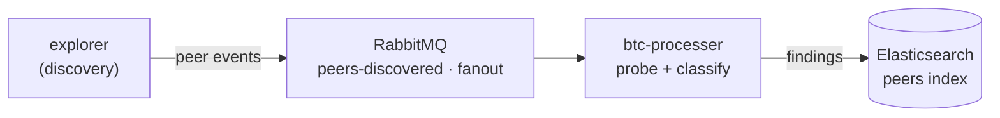

# argos

Distributed P2P blockchain network scanning & vulnerability-analysis pipeline.

[](https://github.com/trustsentinel/argos/actions/workflows/ci.yml)
`Python · AMQP · Elasticsearch` · part of [TrustSentinel](https://trustsentinel.eu)

## Overview
argos continuously discovers and monitors nodes on decentralized networks
(Bitcoin, Ethereum). An **explorer** finds peers and publishes them to a broker;
**processors** consume those events, probe each node (protocol handshake,
version, advertised services), and stream the findings to Elasticsearch.



## Run it
Bring up the whole pipeline with Docker (the explorer discovers live nodes):
```bash
docker compose -f infra/docker-compose.yml up --build
```
- RabbitMQ management UI → http://localhost:15672 (`user` / `password`)
- Elasticsearch findings → http://localhost:9200/peers/_search

Or run a single component by hand, from its own directory:
```bash
pip install -r requirements.txt
python argosx.py --network btc     # in argos-explorer/
python argobtc.py                  # in argos-consumers/btc-processer/
```
Each app reads its `config.yaml`; set `ENV_PROFILE=docker` to use the
`config_docker.yaml` profile (service hostnames) that Compose relies on.

## End-to-end test
Self-contained — a mock node, a synthetic event, and an assertion that it flows
all the way to Elasticsearch, with no live network:
```bash
docker compose -f infra/docker-compose.yml --profile test run --rm e2e
# -> ARGOS E2E RESULT: PASS
```

## Layout
- `argos-explorer/` — node discovery; publishes peer events to the broker
- `argos-consumers/btc-processer/` — probes btc nodes, indexes findings in Elasticsearch
- `argos-consumers/sample-processer/` — reference consumer (logs events)
- `infra/` — Docker Compose stack + the end-to-end test harness (`infra/test/`)
- `modules/`, `reference/kuinetworks/` — staged discovery code to integrate

## License
MIT

<sub>Successor to bluebycode/argos-explorer and the Kui family; continued under TrustSentinel.</sub>
